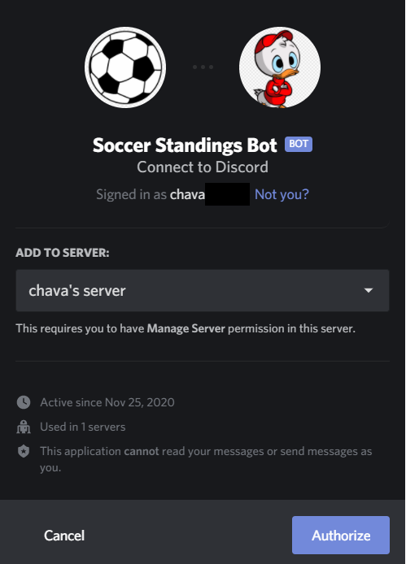

# Soccer Standings Discord Bot
This program is written in python and it creates a Discord Bot that allows you to view the standings of 14 major soccer leagues and seasons 2013-present. This was done by webscraping the ESPN website using the BeautifulSoup4 library.

# Example Output

# How to use the bot:

1. In order to invite this bot into your Discord Server you must have permission to do so in that server. If you have permission, this link will give you the option to add the bot to the server: [link](https://discord.com/oauth2/authorize?client_id=781301326285373460&scope=bot). Following this link should look like this:

