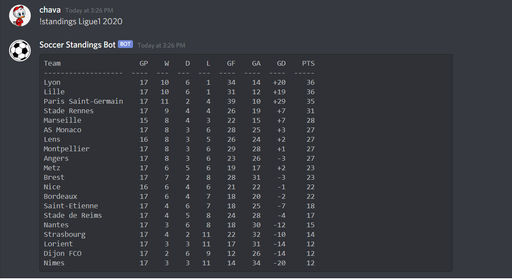

# Soccer Standings Discord Bot
This program is written in python and it creates a Discord Bot that allows you to view the standings of 14 major soccer leagues and seasons 2013-present. This was done by webscraping the ESPN website using the BeautifulSoup4 library.

# Example output

# How to use the chatroom:

1. Open chatserver file and compile chatserver.cpp by typing "make"
2. Run the chatserver program by typing ./chatserver
3. Open chatclient file and compile chatclient.cpp by typing "make"
4. Run the chatclient program by typing ./chatclient
5. In order to exit the program as the client type the message "exit" or ctrl+c.

